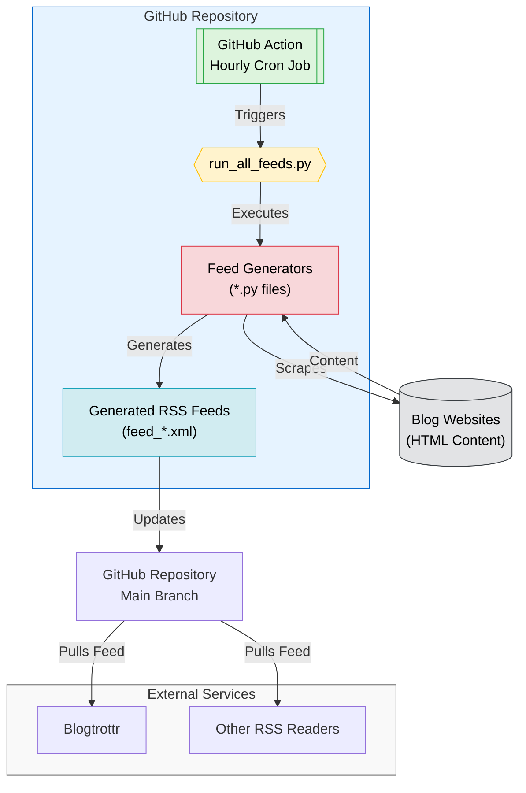

# RSS Feed Generator <!-- omit in toc -->

> Forked from [Olshansk/rss-feeds](https://github.com/Olshansk/rss-feeds)

## tl;dr Available RSS Feeds <!-- omit in toc -->

| Blog                                                                                      | Feed                                                                                                                                                 |
| ----------------------------------------------------------------------------------------- | ---------------------------------------------------------------------------------------------------------------------------------------------------- |
| [Anthropic News](https://www.anthropic.com/news)                                          | [feed_anthropic_news.xml](https://raw.githubusercontent.com/oborchers/rss-feeds/main/feeds/feed_anthropic_news.xml)                                   |
| [Anthropic Engineering](https://www.anthropic.com/engineering)                            | [feed_anthropic_engineering.xml](https://raw.githubusercontent.com/oborchers/rss-feeds/main/feeds/feed_anthropic_engineering.xml)                     |
| [Anthropic Research](https://www.anthropic.com/research)                                  | [feed_anthropic_research.xml](https://raw.githubusercontent.com/oborchers/rss-feeds/main/feeds/feed_anthropic_research.xml)                           |
| [Claude Code Changelog](https://github.com/anthropics/claude-code/blob/main/CHANGELOG.md) | [feed_anthropic_changelog_claude_code.xml](https://raw.githubusercontent.com/oborchers/rss-feeds/main/feeds/feed_anthropic_changelog_claude_code.xml) |
| [Ollama Blog](https://ollama.com/blog)                                                    | [feed_ollama.xml](https://raw.githubusercontent.com/oborchers/rss-feeds/main/feeds/feed_ollama.xml)                                                   |
| [Surge AI Blog](https://www.surgehq.ai/blog)                                              | [feed_blogsurgeai.xml](https://raw.githubusercontent.com/oborchers/rss-feeds/main/feeds/feed_blogsurgeai.xml)                                         |
| [xAI News](https://x.ai/news)                                                             | [feed_xainews.xml](https://raw.githubusercontent.com/oborchers/rss-feeds/main/feeds/feed_xainews.xml)                                                 |
| [Cohere Blog](https://cohere.com/blog)                                                     | [feed_cohere.xml](https://raw.githubusercontent.com/oborchers/rss-feeds/main/feeds/feed_cohere.xml)                                                 |
| [Claude Blog](https://claude.com/blog)                                                    | [feed_claude.xml](https://raw.githubusercontent.com/oborchers/rss-feeds/main/feeds/feed_claude.xml)                                                   |
| [Cursor Blog](https://cursor.com/blog)                                                    | [feed_cursor.xml](https://raw.githubusercontent.com/oborchers/rss-feeds/main/feeds/feed_cursor.xml)                                                   |
| [Dagster Blog](https://dagster.io/blog)                                                   | [feed_dagster.xml](https://raw.githubusercontent.com/oborchers/rss-feeds/main/feeds/feed_dagster.xml)                                                 |
| [Windsurf Blog](https://windsurf.com/blog)                                                | [feed_windsurf_blog.xml](https://raw.githubusercontent.com/oborchers/rss-feeds/main/feeds/feed_windsurf_blog.xml)                                     |
| [The Batch by DeepLearning.AI](https://www.deeplearning.ai/the-batch/)                    | [feed_the_batch.xml](https://raw.githubusercontent.com/oborchers/rss-feeds/main/feeds/feed_the_batch.xml)                                             |
| [Perplexity Blog](https://www.perplexity.ai/hub)                                          | [feed_perplexity_hub.xml](https://raw.githubusercontent.com/oborchers/rss-feeds/main/feeds/feed_perplexity_hub.xml)                                   |
| [Mistral AI News](https://mistral.ai/news)                                                  | [feed_mistral.xml](https://raw.githubusercontent.com/oborchers/rss-feeds/main/feeds/feed_mistral.xml)                                               |
| [AI at Meta Blog](https://ai.meta.com/blog/)                                               | [feed_meta_ai.xml](https://raw.githubusercontent.com/oborchers/rss-feeds/main/feeds/feed_meta_ai.xml)                                               |
| [Groq Blog](https://groq.com/blog/)                                                        | [feed_groq.xml](https://raw.githubusercontent.com/oborchers/rss-feeds/main/feeds/feed_groq.xml)                                                     |
| [AI FIRST Podcast](https://ai-first.ai/podcast)                                           | [feed_ai_first_podcast.xml](https://raw.githubusercontent.com/oborchers/rss-feeds/main/feeds/feed_ai_first_podcast.xml)                              |
| [Weaviate Blog](https://weaviate.io/blog)                                                  | [feed_weaviate.xml](https://raw.githubusercontent.com/oborchers/rss-feeds/main/feeds/feed_weaviate.xml)                                              |

### What is this?

You know that blog you like that doesn't have an RSS feed and might never will?

🙌 **You can use this repo to create a RSS feed for it!** 🙌

## Table of Contents <!-- omit in toc -->

- [Quick Start](#quick-start)
  - [Subscribe to a Feed](#subscribe-to-a-feed)
  - [Request a new Feed](#request-a-new-feed)
- [Create a new a Feed](#create-a-new-a-feed)
- [Star History](#star-history)
- [Ideas](#ideas)
- [How It Works](#how-it-works)
  - [For Developers 👀 only](#for-developers--only)

## Quick Start

### Subscribe to a Feed

- Go to the [feeds directory](./feeds).
- Find the feed you want to subscribe to.
- Use the **raw** link for your RSS reader. Example:

  ```text
    https://raw.githubusercontent.com/oborchers/rss-feeds/main/feeds/feed_ollama.xml
  ```

- Use your RSS reader of choice to subscribe to the feed (e.g., [Blogtrottr](https://blogtrottr.com/)).

### Request a new Feed

Want me to create a feed for you?

[Open a GitHub issue](https://github.com/oborchers/rss-feeds/issues/new?template=request_rss_feed.md) and include the blog URL.

## Create a new a Feed

1. Download the HTML of the blog you want to create a feed for.
2. Open Claude Code CLI
3. Tell claude to:

```bash
Use @cmd_rss_feed_generator.md to convert @<html_file>.html to a RSS feed for <blog_url>.
```

## Star History

[](https://star-history.com/#oborchers/rss-feeds&Date)

## Ideas

- **X RSS Feed**: Going to `x.com/{USER}/index.xml` should give an RSS feed of the user's tweets.

## How It Works



### For Developers 👀 only

- Open source and community-driven 🙌
- Simple Python + GitHub Actions 🐍
- AI tooling for easy contributions 🤖
- Learn and contribute together 🧑‍🎓
- Streamlines the use of Claude, Claude Projects, and Claude Sync
